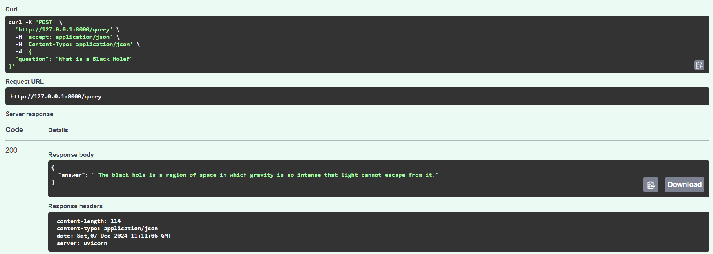
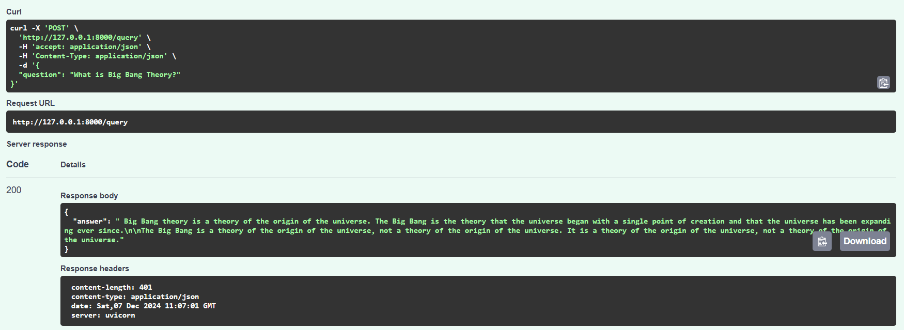

# CosmosGen :  Knowledge-Infused QA System
## Overview
CosmosGen is a powerful Retrieval-Augmented Generation (RAG) system designed to answer questions about the universe, drawing from Carl Sagan's Cosmos as the primary knowledge base. Using cutting-edge machine learning models like GPT-Neo for generative responses and FAISS for efficient vector search, CosmosGen can provide insightful, contextually accurate answers to various questions about space, science, and philosophy.

## Features
- RAG Architecture: Combines retrieval-based search with generative models for comprehensive responses.
- Cosmos Knowledge Base: Uses text from Carl Sagan’s Cosmos as the foundation for answering questions.
- Generative AI: Leverages the GPT-Neo model for generating elaborative answers.
- Vector Database: Stores and searches knowledge using FAISS, ensuring fast retrieval of relevant information.
- API Integration: Built with FastAPI, providing a simple RESTful interface for interaction.

## Testimonials

## License
This project is licensed under the MIT License. See the `LICENSE` file for more details.
